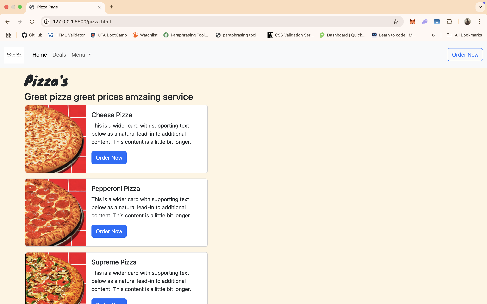

# Tossty Tom's Pizza

## Description
The objective is to create a responsive pizza website were the user can navagate through the diffrent tabs and be able to select the type of pizza, wing and drinks they want and have the choice of either getiing it delivered or for pick up from two locations in the metroplex.

## Screen Shot

### Main page 

### Deals page

### Pizza page

### Wings Page

## Technology used
    * HTML
    * CSS
    * Bootstrap
    * Google Fonts
    

## User Story
- Story 1
    As A User, I want to be able to see mutuple diffrent deal images on the main page So that I can see whats to offer.
    So that

- Story 2
    As A User, I want a navbar at the top of the screen as a fixed top, so that i can always browse through the menu on every page.
    I Want
    So that

- Story 3
    As a user, I want to fill out a contact form with my name, email, adress, and phone number so that I can place an order on the website.

## Wireframe

### Mainpage

## Next Steps
 * Next step would be to add somthing to the Rewards tabs like a membership/ rewards account where the user can earn points as well as make it easier for the user to be able to order their favrites fast and efficently. 
 * I would to work on the responsivenes of the page  when using it on a mobile device.
 * I would also add a menu form to make custom pizzas whith whatever crust, sauce, and topings you want and give it a price.
 * I would also make it so that you can order more then one item and it can caculate the total of all the items.

## Author
Joshua Pierson: [www.linkedin.com/in/joshua-pierson726]
  
